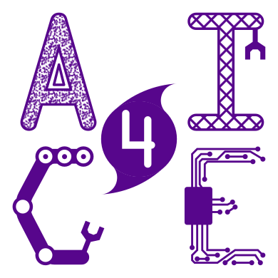

The MARS dataset is curated by members of the [AI4CE Lab](https://ai4ce.github.io/) from New York University. 
The work is made possible by [May Mobility](https://maymobility.com/) with its brilliant team and fleets of autonomous vehicles.

    
    
    

