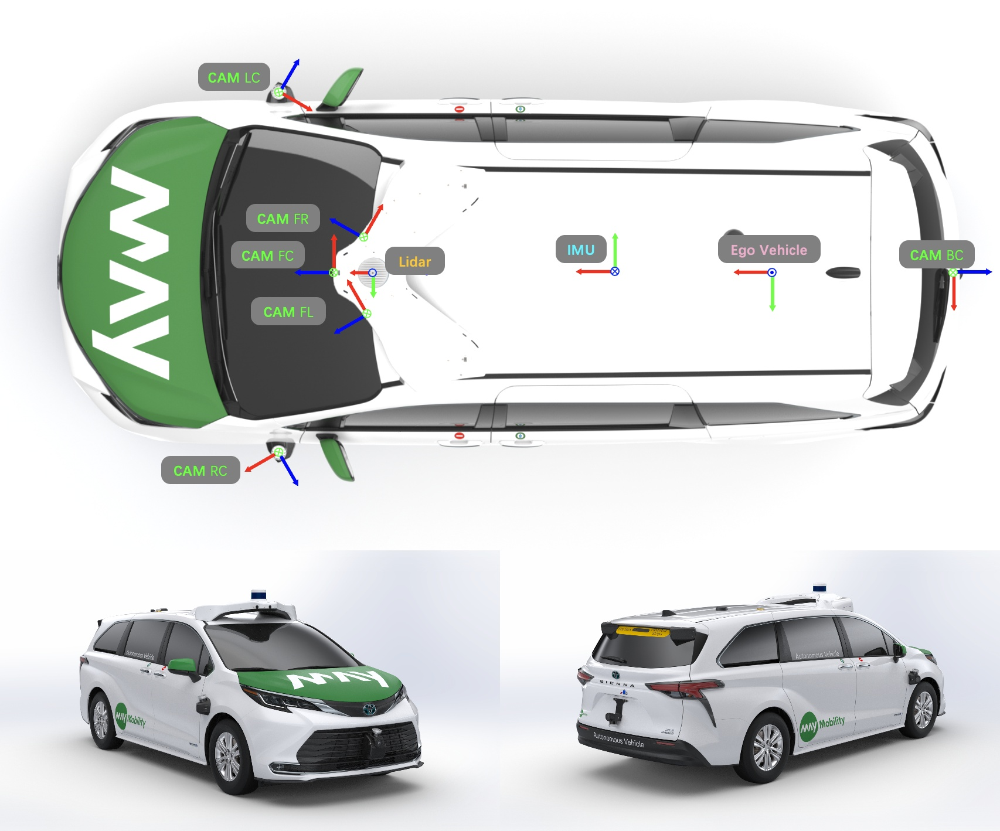

#### The multiagent and multitraversal datasets are now available for download!

<!-- pages/datasets.md -->


  <!-- Display categorized projects -->
  
  <a id="{{ category }}" href=".#{{ category }}">
    <h2 class="category">{{ category }}</h2>
  </a>
  
  
  <!-- Generate cards for each project -->
  
  

    

    
      
    
    

  

  
  

    
      
    
  

  
  



<!-- Display projects without categories -->



  <!-- Generate cards for each project -->



  

    

    
      
    
    

  

  
  

    
      
    
  

  


---
## Vehicle Setup

---
## Sensor Specifications

| Sensor                      | Details                                                                                                                               |
|-----------------------------|---------------------------------------------------------------------------------------------------------------------------------------|
| 1 $$\times$$ LiDAR          | 10Hz, 128 channel, horizontal FoV $$360^\circ$$, vertical FoV $$40^\circ$$                                                            |
| 3 $$\times$$ RGB Camrea     | 10Hz, original resolution $$1440 \times 928$$, sampled to $$720 \times 464$$, Horizontal FoV $$60^\circ$$, Vertical FoV $$40^\circ$$  |
| 3 $$\times$$ Fisheye Camrea | 10Hz, original resolution $$1240 \times 728$$, sampled to $$620 \times 364$$, horizontal FoV $$140^\circ$$, vertical FoV $$88^\circ$$ |
| 1 $$\times$$ IMU            | 10Hz, velocity, angular velocity, acceleration                                                                                        |
| 1 $$\times$$ GPS            | 10Hz, longitude, latitude, elevation                                                                                                  |

