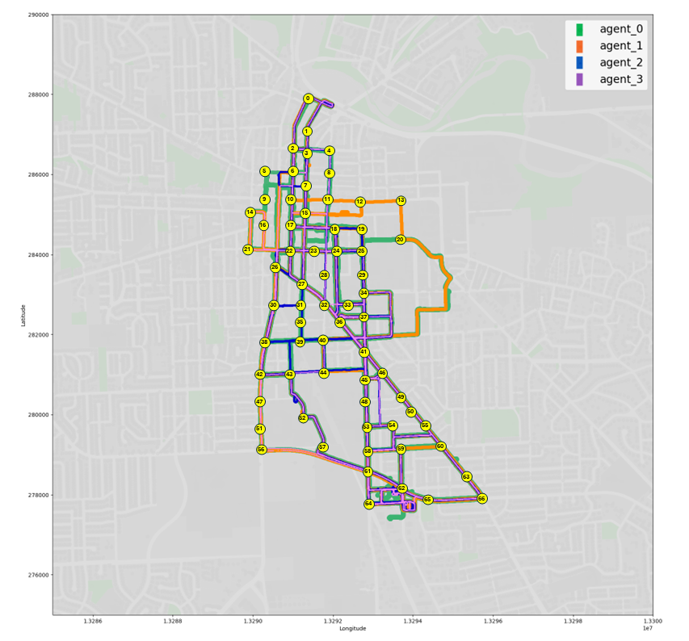
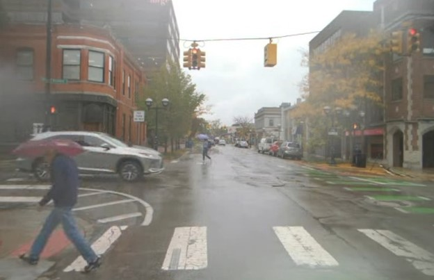

## Route Map with Multitraversal locations

May Mobility is currently focusing on microservice transportation, running shuttle vehicles within a fixed region through various routes and directions.

We selected 67 locations within the vehicles' operation area for multitraversal data collection. 
As demonstrated, the vehicles' routes are randomly distributed across the area.
Note: the 67 locations are indexed from 0-66, but #2 has been removed due to scarcity of data.

    

 

---
The full route is over 20 kilometers long, encompassing urban, residential, highway, and university campus areas with diverse surroundings in terms of traffic, vegetation, buildings, and road marks.

The fleet operates nonstop every workday across the year, therefore covering various lighting and weather conditions with its data.

    
    
    
    
    
    

 

---

#### The multiagent and multitraversal datasets are now available for download!

 

<!-- pages/datasets.md -->


  <!-- Display categorized projects -->
  
  <a id="{{ category }}" href=".#{{ category }}">
    <h2 class="category">{{ category }}</h2>
  </a>
  
  
  <!-- Generate cards for each project -->
  
  

    

    
      
    
    

  

  
  

    
      
    
  

  
  



<!-- Display projects without categories -->



  <!-- Generate cards for each project -->



  

    

    
      
    
    

  

  
  

    
      
    
  

  


 

---
